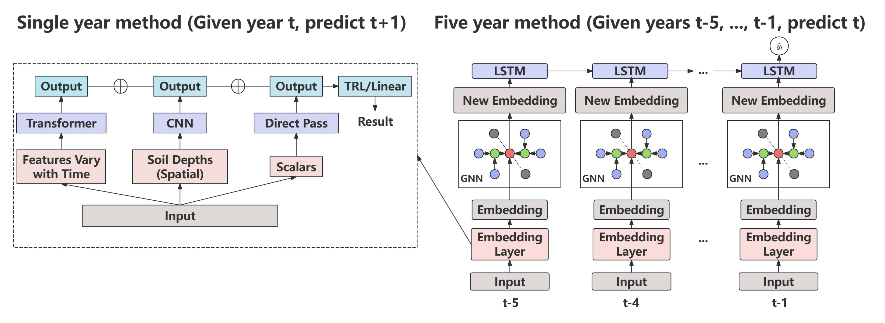

# A Spatial-Temporal GNN-Transformer Approach for Crop Yield Prediction

<div align=center></div>

This codebase is the implementation of the GNN-Transformer model for DSGA1003 Group 6 final project. We built this model upon the baseline model provided by [GNN-RNN](https://arxiv.org/pdf/2111.08900.pdf) model (AAAI 2022) for crop yield prediction in the US. 

## Requirements and installation
- Python 3
- PyTorch 1.0+
- Other packages: dgl, geopandas, numpy, scikit-learn, pandas, matplotlib, tensorboard, tensorly, tltorch

`conda create -n gnn-transformer`

`conda activate gnn-transformer`

`pip install geopandas`

`pip install numpy scipy scikit-learn pandas matplotlib tensorboard tensorly tensortly-torch`

`pip install pytorch torchvision torchaudio pytorch-cuda=11.7 -c pytorch -c nvidia`

`pip install -c dglteam/label/cu117 dgl`

## Data

Sample crop yield dataset is stored in `data/data_weekly_subset.npz` and the nation-wise adjacency map is stored in `map/`.

[This sheet](https://docs.google.com/spreadsheets/d/1hhQ8lGzfgLLyl-gKX13NNboJFywIsJoJOKdttx9hKxE/edit?usp=sharing) contains descriptions of the columns in the dataset. Each row coresponds to one county/year pair.

## Experiment scripts

For all methods, make sure to check the `test_year`, `model`, and `crop_type` parameters. If `train_week` and `validation_week` are set to 52, no masking is performed.

**GNN-RNN**

From the "gnn-rnn" directory, run `./run_train.sh` to train the respective methods.

To test the model, please update the checkpoint `-cp` in `run_test.sh`, and:
```./run_test.sh```
`--validation_week` determines which week to start masking data from (e.g. if it's 26, all features starting from week 26 is replaced with the historical averages, simulating predicting in the middle of the year)

**Single-year baselines**

From the "baselines" directory, run 

`./single_year_run_train.sh cnn`

`./single_year_run_train.sh gru`

`./single_year_run_train.sh lstm`

`./single_year_run_train.sh transformer`

## References
```bibtex
@inproceedings{fan2022gnn,
  title={A GNN-RNN approach for harnessing geospatial and temporal information: application to crop yield prediction},
  author={Fan, Joshua and Bai, Junwen and Li, Zhiyun and Ortiz-Bobea, Ariel and Gomes, Carla P},
  booktitle={Proceedings of the AAAI conference on artificial intelligence},
  volume={36},
  number={11},
  pages={11873--11881},
  year={2022}
}
```
[GNN-RNN](https://github.com/JunwenBai/GNN-RNN)</br>
[CNN-RNN](https://github.com/saeedkhaki92/CNN-RNN-Yield-Prediction)</br>
[DNN](https://github.com/saeedkhaki92/Yield-Prediction-DNN)</br>
